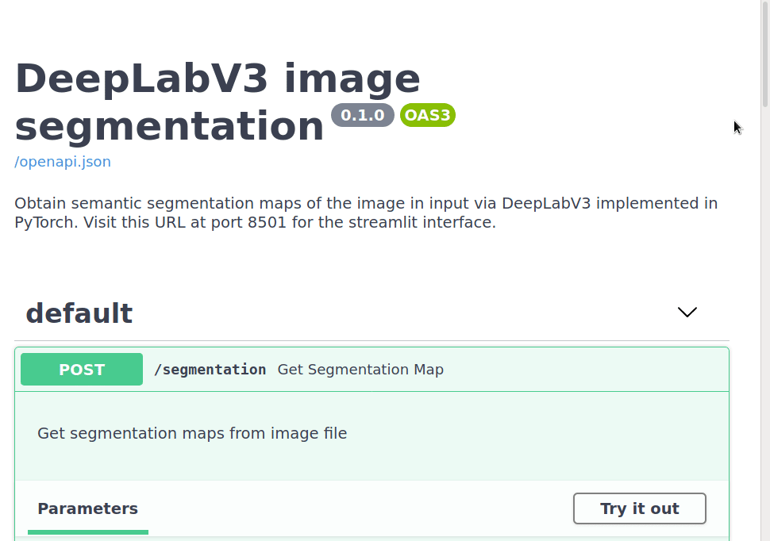

## Serving machine learning models with streamlit and FastAPI

Davide Fiocco  
@monodavide

---

### Machine learning can do cool stuff!

Consider _image segmentation_:

<section>

</section>

--

### We have trained a machine learning model... what now? 

We may want to serve it to users!

---

### We need a frontend...

--

### ...and a backend!

---

### Wouldn't it be nice to do it in pure Python?

---

### A solution using streamlit, FastAPI and Docker

- `streamlit`: to build the UI
- `fastapi`: to build the OpenAPI backend
- `docker-compose`: to orchestrate the two

---

### Idea was well received by the community

 

--

---

## You will learn about:

- a problem that can be solved with ML
- what `fastapi` and `streamlit` can do
- code of dockerized app with a frontend and backend

---

## References

- blogpost: https://davidefiocco.github.io/2020/06/27/streamlit-fastapi-ml-serving.html
- GitHub: https://github.com/davidefiocco/streamlit-fastapi-model-serving